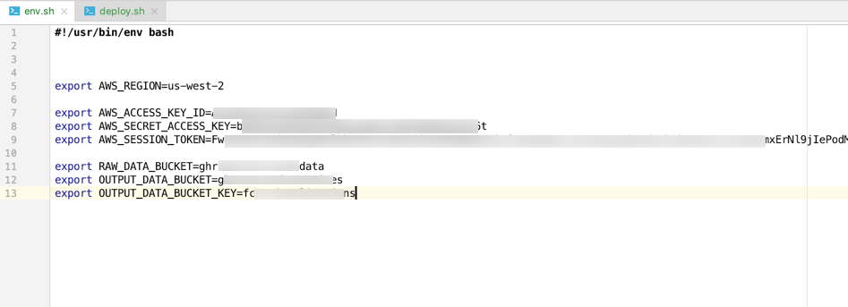
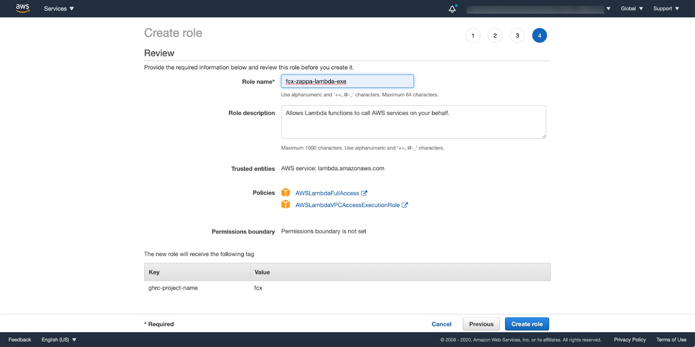

Download the code to your local system:
The source code is available in the GitLab repository.


```
Git clone https://gitlab.com/ghrc-cloud/fcx-backend
```

## Deployment
Following the instructions to deploy your code to local system.

<ol>
<li> Create a new EC2 instance or use an existing EC2 instance</li>
<li> Create a file called env.sh and export following values</li>
<ul>
  <li> AWS_REGION</li>
  <li> AWS_ACCESS_KEY_ID</li>
  <li> AWS_SECRET_ACCESS_KEY</li>
  <li> AWS_SESSION_TOKEN</li>
  <li> RAW_DATA_BUCKET</li>
  <li> OUTPUT_DATA_BUCKET</li>
  <li> OUTPUT_DATA_BUCKET_KEY</li>
  <li> ZAPPA_ROLE_ARN</li>
  <li> SUBNET_ID</li>
  <li> SECURITY_GROUP_ID</li>
</ul>
  
  <li> 
  Create a role to execute Zappa as shown below with permission boundary set to NGAPShRoleBoundary. Then create NASD ticket to request adding following trust relationship
  </li>
  

  <code>
    {
`{
  "Version":"2012-10-17",
  "Statement":[
      {
        "Sid":"",
        "Effect":"Allow",
        "Principal":{
            "Service":[
              "apigateway.amazonaws.com",
              "events.amazonaws.com",
              "lambda.amazonaws.com"
            ]
        },
        "Action":"sts:AssumeRole"
      }
  ]
}`
    }
  </code>

<li>- Add CORS rules to the bucket where processed data is stored</li>
  <code>
    {
    `<?xml version="1.0" encoding="UTF-8"?>
    <CORSConfiguration xmlns="http://s3.amazonaws.com/doc/2006-03-01/">
    <CORSRule>
    <AllowedOrigin>*</AllowedOrigin>
    <AllowedMethod>GET</AllowedMethod>
    </CORSRule>
    </CORSConfiguration>
    `}
  </code>

<li> Run deploy.sh</li>
<li> Processed data will be uploaded into the specified S3 bucket. Enter this information in FCX Frontend configuration file</li>
</ol>


Add CORS rules to the bucket where processed data is stored


