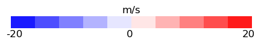
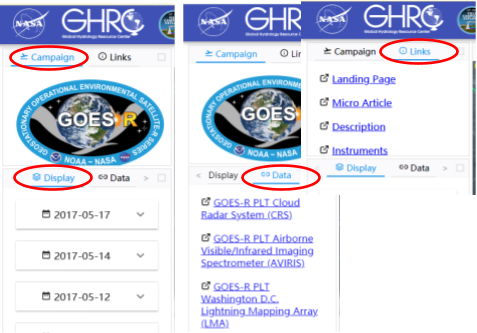

As an explorer, the FCX’s function is not limited to a data visualization tool. An extensive menu bar and mouse functions are equipped to help users navigate the FCX and explore the datasets. A subset function is created for users to select and download subsets of interested data in display for further analyses. These functions are described below.

## General Visualization – Web Delivery

### Data Viewer

The FCX viewer uses the Cesium 3D geospatial platform to deliver visualization for field campaign datasets with geolocational and temporal elements in a web-browser to end users. Depending on the datasets, Cesium’s 3D point cloud, primitive geometry entities, or high level dynamic CZML is employed to create the visualization for an appropriate representation of the datasets (physical variables) and illustration of the variables interaction.

Depicting the variables interaction is of the top consideration for the FCX design for dynamic visualization. While the FCX visualization works to provide the sense of time evolution, it is different from conventional animation in that its display is not a simply connected collective sequence of static graphics. As an explorer FCX also needs to provide context both in time and in space for physical variables and observed events to assist users to gain insight for the relations. This provision of context does not rely on visual memory for linked static frames. For example, the cloud radar reflectivity, an important parameter that can be used to indicate storm convection, precipitation as well as cloud microphysics, is visualized with a 5-min trailing display that shows spatial variation of those factors and their relative position within the traveled section. On the other hand, lightning is an atmospheric charging phenomenon that is a very rapid process. The locations of lightning in a storm can be ever-shifting and hard to predict. A 5-min window would see many overlapping lightning stokes or unsorted lightning frames for a rapidly evolving storm.

For cross-comparison of lightning observations from various instruments, a 1-min interval for all lightning observations is designated to provide a mutual frame for the comparison. Thus, the lightning observations (LIP and FEGS) from the ER-2 aircraft are shown with 1-min trailing display and can be matched with that from satellite or ground observation at the location where the aircraft traversed at the moment. Note that, while the FOV confines of the FEGS detection are projected to the earth surface, the LIP senses the ambient signals (i.e. at the aircraft elevation). Both are displayed at the surface for a side-by-side evaluation. 

The instruments onboard the ER-2 aircraft are looking down toward the ground during the campaign flights. The measurements come with geolocation coordinate of (lat, lon), as well as vertical coordinate, usually in distance (d) from the instruments (aircraft). Given that the on-duty ER-2 routinely cruises at an altitude of ~20 km (and at a speed of ~200m/s), the profiles obtained from these measurements may be approximated with reversed vertical coordinate, say, z = 20 km - d. In FCX, the visualization takes into account the (roll, pitch, heading), in combination with the geolocation and vertical coordinates, to provide a more accurate 3D profile of the measured parameters.
The default 5-min trailing display for the CRS and CPL parameters covers a spatial span of ~60 km that is wide enough to resolve storm cells in a cluster.

Both GLM and ISS-LIS satellite lightning detecting instruments have a 2 millisecond detection timeframe. Such a fine time resolution for the continuous monitoring GLM could result in a large amount of data for dynamic display for rigorous thunderstorms within surveillance range. 3D pointcloud was intended initially for the visualization of the numerous points of data in our first go-around. The lack of control of the size in the near-far view ratio led to the election of Cesium primitive points for both GLM and ISS-LIS datasets visualization.

The visualization is based on lightning events detected at the sensor aperture by both GLM and LIS. For GLM, two parameters are devised to represent the lightning intensity and activity for the minute: 1) intensity – detected optical energy (in Joule) of the lightning at the GLM grid cell, and 2) activity – sum of detected lightning events in the grid cell. The LIS detected lightning is rather transient as ISS is a low-earth orbiting satellite moving at a very fast speed relative to the ground. So, there is no summation of lightning activity or energy for a LIS grid cell as LIS grid cells are not fixed to ground locations. The only display parameter for LIS is intensity that is the detected optical energy density (radiance in µJ/m2/sr/µm) of lightning events.

These three parameters are displayed with size of points relative to the parameters value in the FCX viewer. However, since the two instruments record different energy units (optical energy vs optical energy density), their values or sizes cannot be compared directly. The values or sizes do show the relative intense level of lightning at one location compared to other locations. 

The LMA ground networks detect lightning in the VHF signals and obtain the 3D geolocation (longitude, latitude, altitude) of the signals. Lightning flashes, color-coded based on the altitudes that not only provides a sense regarding the altitude of detected lightning in various viewing angles but also a reference of the vertical scale in the visualization in general. That is especially convenient in comparison with the vertical radar reflectivity curtains from the aircraft measurements.

The Cesium geospatial platform not only gives accurate and reliable positioning of data points in display, it also provides other functions that are supportive for visual exploration. To serve the purpose of visualization for exploration, the zoom in/out control at a user’s fingertip (mouse scrolling) allows for exploring intriguing themes from sub-storm scale (at datasets resolution) to continental scale. Fast forward shrinks storm evolution within minutes or less for inspection. Instant pause/forward/backward allows for repeated examination of a scene or event.  Slow motion and free rotating of the scene makes scrutinizing inter-connection among parameters feasible.

On the whole, the FCX allows examination of the same variable from different instrumental observations. For instance, the Global Precipitation Measurement (GPM) satellite retrieved precipitation can be compared to that measured at surface stations at any time in display for the Olympex Field Campaign; or compared lightning detected by the GLM on the GOES-R to that by the ISS-LIS, the FEGS (GLM simulator) onboard the ER-2 aircraft, or the ground LMA networks for the GOES-R PLT. For cross-examining different parameters in an event, for example, by visualizing radar measurements (reflectivity, Doppler velocity, depolarization, if available), lidar backscattering and detected lightning of an observed thunderstorm, the FCX can be used to illustrate different aspects of a storm system: the dynamics, microphysics, lightning characteristics.

In addition to the display of physical parameters, LMA network stations, ranges (radius of 100, 200km) and flight track are permernent fixture in the the viewer to provide land marks and spatial references. Avatar for the ER-2 aircraft is hovering at the flight altitude in the viewer to indicate the current location of the time and the heading direction as the visualization progresses.

### Color Schemes

Visualization relies heavily on colors to express contents in display. It is inevitable some colors will be overlapped with multiple datasets display, especially when some datasets require nearly full color spectrum to represent the variation range of the values. To alleviate the color overlapping issue, colors for each dataset in FCX are carefully designed. Furthermore, it achieves a better data exploration experience when pairing with the use of display selector to switch on/off a parameter (dataset). 
The color schemes used in the FCX visualization for the parameters are:
ABI IR TB imagery, highlighting the low end temperature with deep purple shades:

<ul>
<li>

ABI IR T_B imagery, highlighting the low end temperature with deep purple shades]

</li>

<li>

CRS reflectivity, using the color scheme commonly used for W-band radar reflectivity in published literature

</li>
<li>

CBS Doppler velocity

</li>

<li>

CPL attenuated total backscatter (1065 nm)

</li>

<li>

FEGS FOV confines in semitransparent lemon-green rgba (150, 255, 50, 120)

</li>

<li>

LIP electric vector in red rgba (255, 55, 55, 255)

</li>

<li>

GLM detected lightning activity in cesium orange

</li>

<li>

GLM detected lightning intensity in yellow rgba (255, 255, 100, 255)

</li>

<li>

ISS-LIS detected lightning intensity in half-opaque light-green rgba (173 , 255  , 140, 153)

</li>

<li>

LMA detected signals color-coded with altitude:

</li>

</ul>

### Dashboard (Timeline)

The Timeline tabulates the GOES-R PLT datasets in the field campaign’s timeframe, if clicked on will switch the FCX screen to the dashboard for this extensive table. It shows each dataset’s starting and ending times.

## Menu Bar

The menu bar is installed to assist FCX users to navigate the display, field campaign events, datasets, and related information about the field campaign and the datasets.  It has two parts: the upper part for the optional external links selection; the bottom part for display selection and campaign data links and download. The default is on Campaign with the display selector for the parameters, shown in Fig. 1. Users can select or switch the display of parameters listed in the selector, to examine the physical variables and their interaction (examples see illustration in 2.1) by clicking on/off a parameter’s button.

*Figure 1. FCX menu bar. The case and display layer selector, the dataset selector with links to the dataset's HyDRO page where field campaigned data are documented, categorized and archived at GHRC, and links to the descriptions of the field campaign.*

The display can be switched to the campaign event selector (Fig 1). From there, users can select the field campaign cases. Users can switch on Data (-)  for campaign dataset link and direct download of the datasets.
The external Links in the upper part of the Menu Bar connects to the field campaign’s landing page, related articles, description and instruments information, including the display schemes and color scales used in the visualization.

## Mouse Functions

### General Mouse Actions

Mouse action is fundamental for navigating the FCX visualization. Moving the mouse around and use the left-click to select objects is a common practice and exercised in the visualization, e.g. use left-click to choose options for display. Likewise, use mouse wheel action to zoom in or out the viewer screen by scrolling the wheel down or up, respectively. Left-click and holding it down enables the mouse movement to assimilate the viewing angle alteration of the viewer screen.

### Mouse-Over and Click Triggered InfoBox

Two additional mouse functions are utilized in the FCX viewer: Mouse-over and Mouse-Click triggered InfoBox.

Cesium has a native InfoBox function that can be triggered by mouse actions. We took advantage of this InfoBox function to show information of some datasets in an InfoBox at the upper-right corner of the FCX viewer screen with mouse-click (left click) action during visualization. Those datasets include FEGS, LIP, and LMA. The FEGS and LIPS detects lightning related signals from the aircraft, to provide validation for GLM detection. In the visualization, the FOV of the FEGS shows up whenever lightning is detected at the instance, to show lightning is sensed within the FOV confines.  When left-clicking on an FEGS FOV polygon, an InfoBox will pop up with the (Lon, Lat) coordinate of the FOV’s 4 corners listed in it. The FCX visualizes the electricity vector sensed by the LIP. Left-click on the vector pops up an InfoBox with the (x, y, z) components of the sensed electricity and the (Lon, Lat) location.

With the stations array, a LMA network is able to locate 3D lightning signals in the VHF frequency within its range. FCX displays the LMA detected lightning in 1-min interval as described in Section 2.1. Based on this implementation, charts of detected lightning spatial variation, temporal evolution, and vertical distribution statistics are made for the minute beforehand. Left-click on any of the LMA lightning will pop up an InfoBox with the aforementioned charts for the minute. The display is instant and does not affect the FCX performance as the charts are pre-made.

To close an InfoBox, left-click on the “x” on the upper-right corner of the box, or somewhere else. Only one InfoBox can be present at a time. So, an InfoBox does not need to be closed before switching to another for a different FEG, LIP or LMA instance.

he Mouse-over function is used for GLM and LIS lightning display that are visualized with Cesium’s primitive points. The point size is preset in proportion to the lightning intensity or activity for the detection (at the grid point for GLM). Moving the mouse over any of the points will enable the display its lightning intensity (or activity, depending on which parameter is switched on) at the instance. The display will disappear as the mouse is moved away from the point.

While activating the mouse functions when the display is paused and becomes static may be preferred for easier operation in some cases, it is not required. The mouse functions can be triggered at any time in visualization.

## Data Subsetting and Download (in progress)

Advanced analyses may be desired to farther the research after a case exploration. Data subsetting provides the function to gather subsectional data of interest to attain this goal for the next step in research.  Click on the “Subset Start” button on the lower-right corner of the FCX screen would initiate the subsetting service at the current view timeframe of an interested instance as the starting point of the subset. Click again on the button, now labeled as “Subset End”, at some view time later to get the end time of the subset. The second clicking will set off the subsetting in the AWS Lambda to gather sub-selection of datasets from satellites and ground networks and subsections of aircraft observations for the intended instance. These data will be placed in a temporary public sub-folder in a GHRC AWS S3 bucket, designated specifically for this subsetting for the user to download. The subset will be kept for, *say a week*, before deletion.   

The data subsets are in their original formats so that they can ingested or processed in the same code as for the original datasets.