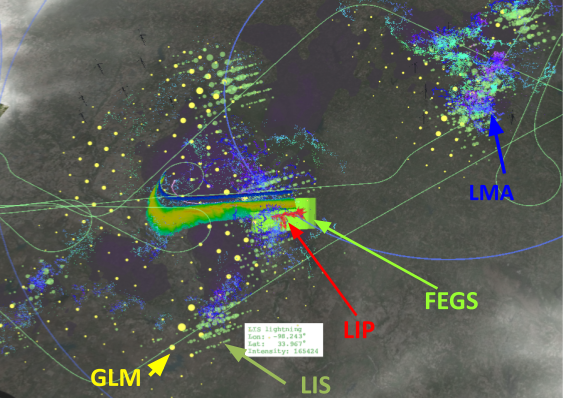
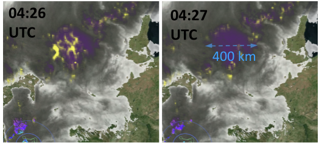
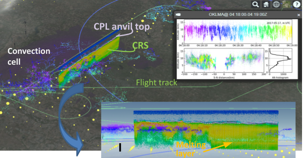

Three use cases demonstrate how to navigate the FCX to explore the events captured by the field campaign observations. A fourth use case illustrates how to use subset function make a subset request.

## Assessment of GLM Detection
**Examined parameters:** ABI brightness temperature, GLM lightning intensity, ISS-LIS lightning intensity, LMA lightning, FEGS lightning detection FOV, LIP atmospheric electric vector, CRS reflectivity (optional)

One major objective of the GOES-R PLT is to validate the GLM lightning detection and assess the detection efficiency. The validation can be approached by comparing the GLM detection to that of FEGS and LIP as the ER-2 travels through the projected GLM grid. On the other hand, GLM’s detection efficiency can be assessed by the overall matching of its detection to that of FEGS and LIP, and by comparing with renowned total lightning (IC + CG) measurements with wide coverage, such as the low-orbiting ISS-LIS satellite lightning detection or the ground network LMA detection, to provide ample instances. The ISS-LIS has a detection efficiency of 70-90% depending on time of day and a swath width of 650 km. In general, the LMAs have a detection efficiency of (95, 90, 80) % within (100, 150, 200) km radius of a network. 

<em>
Figure 3. An instant the FCX screenshot that captures lightning detection from various instruments aboard the FORE-R (GLM), ISS (LIS), ER-2 (LIP, FEGS) ground network (Oklahoma LMA) at the ISS overpass on May 17. 2017. Also shown are the CRS radar reflectivity and underlying enhancedbrightness temperature imagery of the IR channel 13 from FOES-R ABI. The flight track in forest-green is a permanent fixture to offer a reference of scale and coordination in horizontal.
</em>
 

Both types of evaluations are visualized by and can be explored with the FCX. The screenshot shown in Fig. 3 gives an example of how FCX can be used to explore.  In display selector, if not already turned on, switch on display for the GLM (intensity or activity), ISS-LIS, FEGS, LIP, LMA, and CRS reflectivity. Setting the clock to interested time at preferred display speed, say before the ISS overpass. Freeze the display at any moment by “pausing” the clock. Set a proper zoom ratio with the mouse wheel and try various viewing angles to examine the scene with holding the left-click down and moving the mouse around.

## Lightning Observations by the GLM

**Examined parameters**: ABI brightness temperature, GLM lightning intensity (or activity)
Being the first space-borne remote-sensing instrument that monitors lightning continuously both in time and space for larger than continental scale coverage (the Americas and adjacent waters), the GLM can observe lightning activity associated with a storm or frontal system that evolves across a region or continent. The evolution can hardly be captured by the low-earth orbiting ISS-LIS that stares at a same spot for ~90 seconds a day, and easily moves beyond the detection scope of a ground lightning network whose effective detection radius is typically within 150-200 km. 

<em>Figure 4.Elusive lightning incidence and activity observed by the GLM during a frontal strom development across the Northen Great Plains on May 17, 2017. Two panels show the detected minute-by-minute lightning activity on top of the strome convective core represented by the highlighted (purple) area of the GOES-R band-13 T_B imagery. Also shown in the OKLMA network (part of the 100 and 200 KM radius of the LMA range) at the left bottom corner of the snapshots.
</em>
 

The use case aims at the storm that was embedded in the Northern frontal system of May 17, 2017 over the Northern Central Plains in the evening and continued to evolve and migrate to north of the Great Lakes into the night. The entire evolution, from incipient stage at 02-03 UTC, peak development at 04:30 UTC, to dissipating phase after 07 UTC is visualized by the FCX.  
1. set time-multiplier (x60 sets 60 seconds of display in 1 second) and proper zoom ratio of the screen, replay the display to show the evolution in condensed time
1. Examine the lightning location in relation to the storm cell connoted by the ABI IR channel brightness temperature, in varying storm evolution stages
1. Variation in location of high lightning intensity
1. Elusive lightning incidence minute-by-minute, as shown in the Fig. 4, can be examined with the FCX 

## Storm Characteristics – Lightning, Microphysics, Dynamics

**Examined parameters**: ABI brightness temperature, CRS reflectivity (optional: Doppler velocity), CPL backscattering, LMA lightning 
One of the weather systems surveyed during the GOES_R PLT was a spring frontal system with residents of thunderstorm clusters sweeping across the Southern Central Plains (May 17, 2017). The storm cells were evolving and travelling with the system.  It is a good opportunity to compare the airborne measurements with those from the ground network for different storm characteristics. First, zoom in to a proper scope for an event of interest. It may be helpful to know that the trailing length for the CRS display is ~ 72 km if setting linger = 360s (see Section 4.2 Frontend Code). This offers a good perspective of the spatial scale. A nearly horizontal view gives the lightning (LMA observation) distribution’s spatial relation to the convection cell (IR channel BT).  

<em>
Figure 5. Exploring different aspects of a thunderstorm. The CPL backscattering the fine ice particles at the cloud top while the CRS reflectivity shows the very dense ice cloud layer (and attenuated by the layer). Lightning detected by the LMA network indicates major lightning activity coincides with the strong ice cloud reflectivity. Somewhat strong intensive activity occurs between the major lightning layer (ice cloud) and the melting layer, indicating the mixed phase graupel.
</em>
 

The color-coded LMA lightning indicates where lightning was most active in vertical. Change the view to nearly vertical to examine how lightning incidences line up with the cloud hydrometers identified by the cloud radar. While the CRS is quite sensitive to the small ice cloud particle, the cloud lidar (CPL) gave the definite cloud top. 

Click on the LMA lightning, charts of the lightning distribution and vertical histogram for the one-minute time period will appear in the InfoBox.

## Request a Subset

***Feature Under Construction***

This part has to wait until the subset button is installed.

