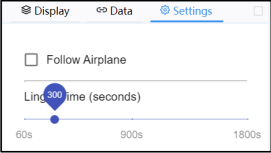

## Field Campaign Explorer (FCX) basic instructions

These instructions will provide very basic use guidelines to utilize the Field Campaign Explorer (FCX).

The public link to FCX is: https://ghrc.earthdata.nasa.gov/fcx/index.html.

When you click on the link, FCX will begin to load and you will see this occurring with the FCX logo overlaid.

*Figure 1: Initial Field Campaign Explorer (FCX) loading page.*

The initial, public release uses the 17 flights from the GOES-R Post Launch Test (PLT) field campaign. This
campaign was selected as it has been fully archived at GHRC DAAC and contains a variety of ground-,
airborne-, and satellite-based products. FCX loads with the last flight of the PLT field campaign from May 17,
2017. The default time for this loading is 0545 UTC, corresponding to the main period of scientific observations
and an International Space Station Lightning Imaging Sensor (ISS LIS) overpass as the ER-2 returned to
California from Georgia.

*Figure 2: The initial view of FCX once it first initially loads.*

   

   

  *Figure 3: Information available on the field campaign being viewd (GOES-R Post Launch Test in this example) that provides a short description of the campaign (top) and the available links for more information (below).*

  

  

  Let us familiarize ourselves with the FCX layout. The upper left contains information on the field campaign that is currently active. In this case, it is the GOES-R PLT. When you click on this window, you can scroll and read information about the GOES-R PLT. When you click on the “Links” option in this window, it provides various links for you to access to more information about the field campaign including the landing page, GOES-R PLT micro article, campaign description, and the list of instruments for the campaign. The landing page offers the most extensive option to further explore the details of the campaign with links to each published dataset’s landing page that will enable you to access data downloads, user guides, and associated micro articles.

  

The next part to view is the data selection pane. This defaults to the “Display” link, highlighted in blue. Under the Display link, you can choose what days to view, currently 2017-05-17. If you click on the date, it will collapse the instrument information windows  and allow you to select different days during GOES- R PLT. Also, the Display link allows you to toggle  available instruments on and off in the main display.

    

  *Figure 4: The initial view of data selection pane.*

  

In the example to the left, the Advanced Baseline Imager (ABI) is shown. The green image to the left indicates it is a satellite product, while the selector to the right is “active” indicating that the ABI is being displayed. Below the Advanced Baseline Imager name, additional information is shown. This includes what ABI channel is displayed (13) and the basic color curve or display style is used.

  

  *Figure 5: Data selection pane under
  the 'Data' link providign access to all
  datasets with the GOES-R PLT field
  campaign.*
  

Staying within the data selection pane, you can click on the “Data” link,
highlighted in blue to the left. This brings up the links to every dataset associated
with the GOES-R PLT, including those that may not be available to display at
this moment.

  

  Lastly, within the data selection pane, you can click on the “Settings” link, highlighted in blue in the image to the right. This has two options that users may adjust. The first option is to toggle the display to follow the aircraft during visualization or to maintain a fixed viewing location. The fixed viewing location is the Figure 6: The data select pane under the default setting for FCX as seen in Figure 2. "Settings" link.
  

*Figure 6: The data select pane under the "Settings" link.*

  

Figure 7 shows a view when the “Follow Airplane” option has been toggled on. The second “Linger time” option sets how long data remains on the display. The default is 300 s (5 min). This is most clearly seen with the Cloud Radar System that provides a vertical curtain of observations that will be longer (or shorter) depending on the linger time.

*Figure 7: Field Campaign Explorer display when the follow airplane option has been toggled on.*

*Figure 8: Basic data viewer pane view in Field Campaign Explorer with the display help menu open.*

Figure 8 shows the main data viewer pane. This is where you are able to interact with a visualize the various datasets. If you click on the question mark in the upper right, it will provide the help options on how to adjust the visualization with a mouse (shown) or using a touchpad. These options allow you to pan the image, zoom in and out, and rotate the view. Please note that changing the view may take a few moments, depending on your graphics card. FCX uses a dynamic scaling to handle three dimensional datasets and to be able to quickly pan, rotate and zoom the image.

The lower part of Figure 8 is the time management tools. The lower left allows the user to pause, rewind, or play through the available data. Figure 8 shows that when the display is set to play, it will move at 10x normal. Users can click on the arc around the time manager to speed up or slow down the display. Furthermore, along the bottom of the display is a timeline. The blue square notes where you are in time. You can click on this blue square and move it forward or backward to set the display to the time you desire. 

Figure 9 shows the data viewer pane if you click on the “Timeline” link in the upper left. This is a useful view to identify when various datasets are available for display. This can help identify observations of coincidence when trying to coordinate between satellite overpasses, the time of the actual flight, and other datasets. The vertical red line offers a visual aid to quickly identify what datasets are available at the same time. Also, please note that the Timeline view only shows instruments that are toggled on for display in the data selection pane.

*Figure 9: The 'Timeline' view of the data viewer pane that allows users to quickly when various observations are coincident.*