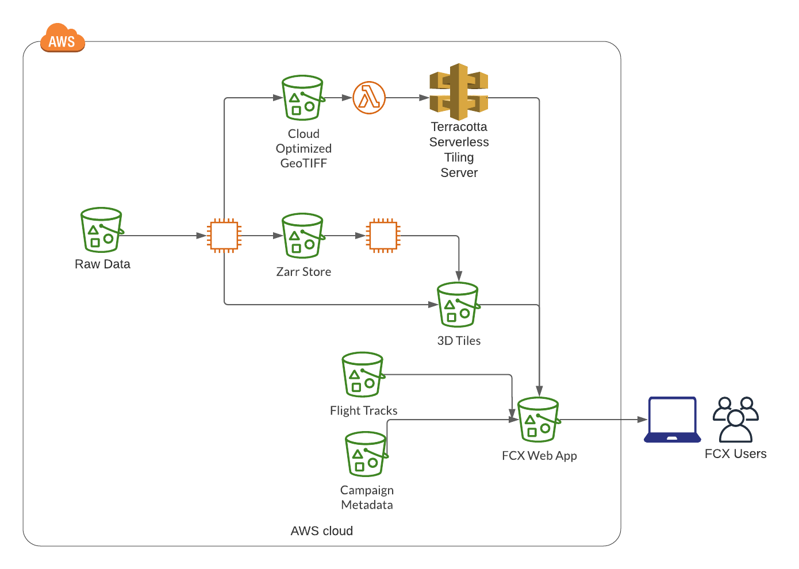

<p>
FCX was originally designed to support the Hurricane and Severe Storm field campaign. Since this original iteration, FCX has evolved to fully support three components. First, FCX uses a cloud-native infrastructure. Second, FCX is a data exploration tool. Lastly, FCX is being designed to incorporate supplemental analytic capabilities to support science in the cloud.
</p>

<p>
The FCX can be separated into two major apparatuses: the frontend that includes visualization, menu bar, and data subsetting; and the backend field campaign data ingestion and processing. The frontend takes care of the web-based app and is developed mostly in Javascript (and html and CSS) to use CesiumJS. The backend is encoded mostly in Python. They are in the following pages. 
</p>

## The Arcitecture in Cloud*

<p>
The backend code is held at AWS EC2 and integrated and executed at an AWS EC2 instance with input of observational datasets stored at an S3 bucket and processed or pre-processed visualization data output to another S3 bucket. One the other hand, the frontend web-app is hosted also at EC2 with its visualization data housed in this other S3 bucket. Access of data in S3 from EC2 can be as slow as accessing from a local computer if the bucket and EC2 are not set up in the same region.
</p>

<div
  class="center"
>
  
</div>

## The Frontend Code

<p>
CesiumJS supports drawing and layering high-resolution imagery (maps) from many services. Tile your own imagery layers from raster data to CesiumJS apps. Layers can be ordered and blended together. Each layer’s brightness, contrast, gamma, hue, and saturation can be dynamically changed.
</p>

<p>
Note that users can alter the “linger” parameter in the frontend Javascript code to adjust for the trailing display of the CRS reflectivity/Doppler velocity and the CPL backscattering. NASA’s ER-2 typically cruises at 200 m/s speed when on field duty. That yields ~60 km long of the trailing display for linger = 300 (sec) and ~72 km for linger =360.
</p>

## The Backend Code

<p>
The backend code is programmed in Python 3 and mutually includes three processes for each dataset: data ingestion, processing, and graphic data preprocessing or production. A copy of all GOES-R PLT datasets is currently stored in one of our public AWS S3 buckets. Data is ingested directly via cloud access, i.e. from the AWS S3 bucket, except for (ABI) that uses a specific reader python package (GDAL) that does not support direct cloud access of the file type. Therefore the ABI data have to be downloaded to the AWS EC2 (or local disk) to be processed.  Afterwards, the graphic data produced by the backend code is uploaded to another public S3 bucket for FCX visualization to access or process. We have also made local access an option in the code for users. This option is particularly useful for users that develop their own analysis with the subset data.
</p>

<p>
Access of data in S3 from EC2 can be as slow as accessing from a local computer if they are not in the same region. Should:

<ol>
  <li>
  Check out VPC endpoint connection between EC2 and S3 later. 
  </li>
  
  <li>
  Check out use of d ask for multi-processing the backend code.
  </li>
</ol> 
</p>

<p>
In the current form, a Bash script is run from our EC2 instance to process a dataset for all the field campaign days before moving on to another dataset. The script passes to the python code the date/time, input/output data locations for the code to start ingesting and processing the data. The ingestion/processing and graphic data pre-processing or production modules are described in the following pages.
</p>

### Utility Code

**Code:** FCX_utils.py

**Main Functions:**

```
S3listFCX (s3bucket, fdate, instrm [, network] )

List data file(s) for dataset [instrm] for flight date [fdate] in [s3bucket].
If the dataset is LMA, specify the network name, e.g. ‘OKLMA’.

s3bucket: bucket name in S3 that houses the GOES-R PLT datasets
fdate: flight date of GOES-R PLT field campaign for selected case
instrm: dataset of instrument to be processed, e.g. FEGS
network: optional, LMA network name, also used in the LMA data filename
```

```
s3FileObj (s3bucket, fname [,verb] )

Get the file object for file [fname] in bucket [s3bucket]

s3bucket: bucket name in S3 that houses the GOES-R PLT datasets
fname: full path filename
verb: optional, =True: turn on printouts for more information about the execution
```

A set of python functions that are commonly used by different modules in the backend code resides in the FCX_utils.py. Those utility functions include information of GOES-R PLT specific field campaign domain, timeframes, time unit conversion, local data folder creation, as well as services for AWS S3 bucket access. The Python s3fs package is used to provide local file system like access to our raw data in the S3 bucket, with an extra step to open a file as an object before reading data from it.
AWS account related information for authorization for cloud access, is not in any of the code.


### ABI IR Imagery (B_T)

The FCX uses Cesium imagery provider WMTS to provide tiled imagery service for the ABI IR channel brightness temperature. The tiling server allows clients to request detailed portions of an image as needed in visualization. Instead of retaining the entire file, the display would stream only the parts in range and spare the visualization resource for managing other data (move to frontend?). To make the tiled imagery layer, the backend process goes through the following steps:
1. Create raster imagery in geotiff format using the Python GDAL package (mk_gdaltif.py);
1. Create cloud-optimized raster imagery (optimized and compressed geotiff) using Terracotta command
1. Ingest cloud-optimized raster imagery and uploaded them to the cloud (abi.py)
1. Deploy cloud-optimized raster imagery is deployed to ASW (serverless deployment) using Terracotta package

Both the GDAL and Terracotta packages have to be installed beforehand. And a .sqlite file that keeps the record of the imagery deployment to the S3 bucket is generated from step 3 and is referenced in the raster files deployment.  Note that a python virtual environment is set up under the Terracotta folder for step 4 implementation. As step 4 does not work directly on Windows computers, Windows Subsystem for Linux (WSL) has to be installed for Windows computers. Detailed operation for the deployment can be found at https://terracotta-python.readthedocs.io/en/latest/tutorials/aws.html. 

A color scheme is created specifically for the IR channel BT to highlight areas with very low cloud top BT that indicates high cloud top (anvil) and convective cores. The highlighted areas are in hues of purple among grey scaled clouds. The color scheme is added to the color map collection in Terracotta (under terracotta/terracotta/colormap/data/) before the optimized raster imagery deployment to the cloud. The color scheme created for the ABI BT is named goesr_tb_rgb.npy and referred as “colormap=goesr_tb” in the frontend code.

**Code:** 

```
mk_gdaltif.py 
abi.py 
abi_zappa.py
goesr_tb_rgba.npy (color map data)
```

**Input:**
```
OR_ABI-L1b-RadC-M3C13_G16_*.nc
```

**Output:**
```
*.tif (intermediate and deployed)
```

### GLM and LIS

Both datasets are in netCDF4 format and are ingested with python package xarray.open_dataset() and processed with pandas DataFrame to produce geolocation and display parameters for the frontend visualization. Pandas DataFrame is used particularly for data consolidation with the aggregate functions. 
GLM_subcode.py includes the function to locate GLM data files for the selected time period, the function to ingest the data to pandas DataFrame, and the function to make the json format output for the points visualization. The GLM data files are every 20 seconds. That results in 900 files for a 5-hour period for heavy I/O overhead in ingesting the data. 

LIS_subcode.py contains the function to search for LIS files in the selected time period and domain, and also the functions to ingest the data to pandas DataFrame and make json format output for the points visualization. While there are up to 2 ISS overpasses/day over a region in the tropics and up to 2 overpasses/day in the higher altitudes, there may be one or none ISS overpass at a particular time window over a field campaign domain. The overpass time is not easily estimated as the ISS is not sun-synchronized.

**Code:** 

```
GLM_points.py, GLM_subcode.py
LIS_point.py, LIS_subcode.py
FCX_utils.py
```

**Input:**
```
OR_GLM-L2-LCFA_G16_*.nc
ISS_LIS_SC_V1.0_*.nc
```

**Output:**
```
GLMpoints.json
LISpoints.json
```

**Main functions for GLM:**

```
makeGLMpoints (fdate)

The general code to process data for a specific flight date [fdate] for GLM datasets

fdate: flight date of GOES-R PLT field campaign for selected case
```

```
GLMfiles (s3bucket, fdate, tstart, Trange [, files])

Locate GLM files in [s3bucket] in time period [Trange] starting from [tstart] for flight date [fdate]

s3bucket: bucket name in S3 that houses the GOES-R PLT datasets
fdate: flight date in GOES-R PLT field campaign for selected case
tstart: start time for the data to be processed for the specified case
Trange: time range from tstart for the data to be processed
Files: optional, files from previous search results, to be skipped for current search to speed up the search

RETURN: list of GLM files  
```

```
get_GLMdf (file, currFT, fdate)

Read GLM data from file or file object [file] into DataFrame for current time [currFT] for flight date [fdate]. 

file: obtain data from this file or file object
currFT: current time
fdate: flight date of GOES-R PLT field campaign for selected case

RETURN: DataFrame for the GLM data
```
**Main functions for LIS:**

```
makeLISpoints (fdate)

The general code to process data for a specific flight date [fdate] for LIS datasets

fdate: flight date of GOES-R PLT field campaign for selected case
```
```
mk_points (DFo, filepath)

Make json format output [filepath] for DataFrame [DFo]

DFo: DataFrame that holds the data for this process to make pre-processed data for primitive point visualization
filepath: full path filename for the output  
```

```
LISfiles (s3bucket, fdate, bigbox, start, end [, Verb])

Search for LIS files in [s3bucket] within the [bigbox] domain for the time period [start] to [end] for flight date [fdate]

s3bucket: bucket name in S3 that houses the GOES-R PLT datasets
fdate: flight date in GOES-R PLT field campaign for selected case
bigbox: the minima and maxima of the latitudes and longitudes that constitutes the domain for the search for ISS-LIS files
start: start time for the data to be processed for the specified case
end: end time for the data to be processed for the specified case
Verb: optional, =True to for printouts of information regarding the search process. Default = False

RETURN: list of LIS files  
```

```
get_LISdf (fileobj, fdate)

Read LIS data from file or file object [file] into DataFrame

fileobj: obtain data from this file object
fdate: flight date of GOES-R PLT field campaign for selected case

RETURN: DataFrame 
```

### CRS (reflectivity and Doppler velocity) and CPL attenuated backscattering

All three parameters are ingested with xarray.open_dataset() and visualized with Cesium 3D pointcloud. The differences are 1) we experimented using Zarr with the CRS reflectivity (REF) in the original design to have an integrated frontend-backend operation in cloud. CRS Doppler velocity (DOP) and CPL attenuated total backscattering (ATB) are processed directly without zarr chunking operation; 2) The color scheme for CRS REF is set in the frontend at display for the range of (-40, 40) dBZ in colors commonly used for the w-band reflectivity, for a more intuitive association with other cloud radar bands reflectivity. On the other hand, the color schemes for DOP and ATB are preset in the backend code. These variants demonstrate different ways of color setting for Cesium 3D pointcloud for the user community.

**Code:** 

```
CRS_ingest.py, point_cloud.py, tileset.py (reflectivity)
CRS_pcloud.py, CRS_subcode.py (Doppler velocity)
CPL_pcloud.py , CPL_subcode.py (Backscattering)
FCX_utils.py
```

**Input:**
```
GOESR_CRS_L1B_*_v0.nc
```

**Output:**
```
tiled Cesium 3D pointcloud files and associated tileset json
```

**Main functions for CRS Reflectivity:**

```
ingest (folder, file)

The general code to process CRS reflectivity to make 3D pointcloud data for visualization

folder: the folder/directory where the chunked data will be stored
file: the CRS filename
```

```
Class PointCloud 
All the functions below are defined this PointCloud class.
```

```
generate (self, tile, start, end)

Make 3D pointcloud data and associated feature table and batch table for a specific [tile] for the time period (start, end).

tile: tile number
start: starting time of an epoch for a tile
end: end time of an epoch for a tile
```

```
cartographic_to_cartesian (lon, lat, alt)

Convert geolocation [lon, lat, alt] to Cartesian coordinate that will be used in the Cesium visualization.

lon: longitude array for the coordinate conversion
lat: latitude array for the coordinate conversion
alt: altitude array for the coordinate conversion
```

**Main functions for CRS DOP:**

```
CRSpoitncloud (fdate)

The general code to process CRS Doppler velocity to make 3D pointcloud data for visualization

fdate: flight date in GOES-R PLT field campaign for selected case
```

```
CRSaccess (fname, s3bucket, awsRegion='us-west-2', Verb=False)

Access CRS file [fname] in [s3bucket] as a file object. 

fname: full path filename for the CRS dataset
s3bucket: bucket name in S3 that houses the GOES-R PLT datasets
awsRegion: AWS region where the S3 bucket is assigned

RETURN: file object of the CRS file
```

```
class Tileset
Set up the output tileset json file
```

```
make_pcloudTile (vname, tile, tileset, DF, epoch, end, folder, steps)

Make 3D pointcloud data and associated feature table and batch table for a specific [tile] for the time period [epoch, end] for variable name [vname]. The data to be processed are held in [DF] DataFrame. The processed visualization data (tiles, tileset json) are saved to [folder].

vname: variable name, ‘vel’ for Doppler velocity; ‘ref’ for relectivity
tile: tile number
tileset: the tileset class for this pointcloud
DF: DataFrame
epoch: starting time of an epoch for a tile
end: end time of an epoch for a tile
folder: the folder/directory path where the tile files will be saved
steps: steps for the tiles appearance for certain near-far ratio in FCX viewer
```

```
cartographic_to_cartesian (lon, lat, alt)

Convert geolocation [lon, lat, alt] to Cartesian coordinate that will be used in the Cesium visualization.

lon: longitude array for the coordinate conversion
lat: latitude array for the coordinate conversion
alt: altitude array for the coordinate conversion
```

```
color_encodeDOP (var)

Color encoding for the data values in [var]. Display values between -20 and 20 m/s with increment of 4 m/s.

var: data array for the color encoding

RETURN: color code for the data array 
```

**Main functions for CPL ATB:**

```
CPLpoitncloud (fdate)

The general code to process CPL backscattering to make 3D pointcloud data for visualization

fdate: flight date of GOES-R PLT field campaign for selected case
```

```
class Tileset
Set up the output tileset json file
```

```
make_pcloudTile (vname, tile, tileset, DF, epoch, end, folder)

Make 3D pointcloud data and associated feature table and batch table for a specific [tile] for the time period [epoch, end] for variable name [vname]. The data to be processed are held in [DF] DataFrame. The processed visualization data (tiles, tileset json) are saved to [folder].
vname: variable name

tile: tile number
tileset: the tileset class for this pointcloud
DF: DataFrame
epoch: starting time of an epoch for a tile
end: end time of an epoch for a tile
folder: the folder/directory path where the tile files will be saved
steps: steps for the tiles appearance for certain near-far ratio in FCX viewer
```

```
cartographic_to_cartesian (lon, lat, alt)

Convert geolocation [lon, lat, alt] to Cartesian coordinate that will be used in the Cesium visualization.

lon: longitude array for the coordinate conversion
lat: latitude array for the coordinate conversion
alt: altitude array for the coordinate conversion
```

```
color_encodeATB (var, fdate)

Color code for the data values [var]. [fdate] sets some color ranges for specific cases.

var: data array for the color encoding
fdate: flight date of GOES-R PLT field campaign for selected case

RETURN: color code for the data array 
```

### LMA

The LMA code ingests the data from zipped csv (text) files, produces 3D pointcloud tiles and CZML file for the Cesium viewer display. The processing also includes a filter for retaining valid data. In addition, it also creates charts of horizontal distribution and vertical histogram for the detected lightning sources. The charts are for the InfoBox display for a specific time instance.   
LMA files are typically of 10-minute or 1-hour per file and have common header and data section formats, even for data from different networks.

The 3D pointcloud data is color-coded to show altitude information.

**Code:** 

```
LMA_pcloud_czml.py
LMA_subcode.py
FCX_utils.py
```

**Input:**
```
goesr_plt_*LMA_*.dat.zip
```

**Output:**
```
tiled Cesium 3D pointcloud files, associated tileset json, and xxLMA_tiles.czml
s*.png (charts for InfoBox)
```
**Main functions:**

```
makePointCloud (fdate, network)

The general code to process LMA data to 3D pointcloud, CZML and charts, for flight date [fdate] for a specific LMA network

fdate: flight date of GOES-R PLT field campaign for selected case
network: LMA network name, also used in the LMA data filename  
```

```
class lightning
Set up lightning class and geolocation to Cartesian conversion function for the lightning data
```

```
class tileset
Set up the output tileset json file
```

```
get_LMA (bucket, file [, stns_min] [, nheader] )

Ingest LMA data from [file] in [bucket]. Process data with set criteria: same signal detected by minimum of [stns_min] stations (and chi^2 < 1)

bucket: bucket name in S3 that houses the LMA dataset (same for other GOES-R PLT datasets)
file: full path LMA filename
stns_min: optional, minimal number of station as a criterion to validate LMA lightning signal, default = 7.
nheader: optional, number of  file header lines 
RETURN: DataFrame, nheader
```

```
get_LMAheader (bucket, file [, slabel] )

Sort out the file header lines for [file] in [bucket] with data line identifier [slabel]

bucket: bucket name in S3 that houses the LMA dataset (same for other GOES-R PLT datasets)
file: full path LMA filename
slabel: optional, data line identifier in LMA files. Default = '\*\*\* data \*\*\*'
RETURN: number of file header lines
```

```
LMAcharts (DF, epoch, end, Sec0, xlab, xRange, folder, LatLonCen=False)

Make charts for horizontal time evolution and vertical histogram of lightning DataFrame [DF]. The charts will appear in the InfoBox for the time period [epoch-end] if it is activated in FCX viewer.

DF: DataFrame that holds the LMA data
epoch: starting time of an epoch for 
end: end time of an epoch for a tile
Sec0: current day 00 UTC in [seconds] from 00 UTC of 1970-01-01
xlab: x-axis label
xRange: x-axis plotting range
folder: the folder/directory path where the tile files will be stored and linked for the InfoBox display
LatLonCen: optional, adjustment for the center of the chart if horizontal coordinate is in (lat, lon).
```

```
LMAfiles (s3bucket, fdate, tstart, Trange, network='OKLMA')

Look for LMA files in [s3bucket] for period [Trange] starting from [tstart] for flight date [fdate] 

s3bucket: bucket name in S3 that houses the GOES-R PLT datasets

fdate: flight date of GOES-R PLT field campaign for selected case
tstart: start time for the data to be processed for the specified case
Trange: time range from tstart for the data to be processed
network: optional, name of the LMA network whose data are to be processed, default = ‘OKLMA’
RETURN: list of LMA files  
```

```
MK_cloud_czml (intr, tile, step, tileset, Ldata, skip, varEnc, folder2)

Make pointcloud for [tile] of lightning data [Ldata] with color encoding to variable [varEnc]. Save the tiles to [folder2]. Both [Step] and [skip] are set to 1, no data are skipped. [varEnc] =’Alt’

intr: LMA network name, e.g. ‘OKLMA’
tile: tile number
step: =1
tileset: the tileset class for this pointcloud
Ldata: the lightning data class that holds the LMA data DatFrame
Skip: =1, no skip of data points
varEnc: name of variable in the Ldata DataFrame to be color coded
folder2: the folder/directory path where the tile files will be saved
```